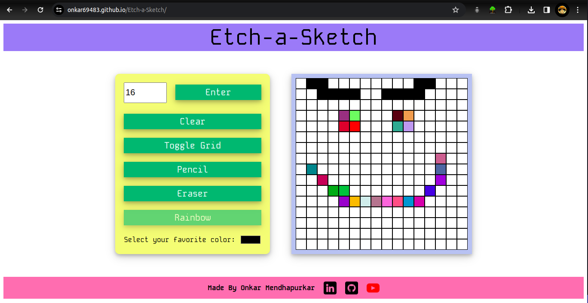

# Etch-a-Sketch Web Application

Visit -> [Etch-a-Sketch](https://onkar69483.github.io/Etch-a-Sketch/).

Welcome to Etch-a-Sketch, a simple yet fun web application that allows users to unleash their creativity by painting on a digital canvas. Whether you're an artist or just looking for a way to relax and doodle, Etch-a-Sketch offers a range of tools and options to cater to your painting needs.

## Features

- **Grid Painting**: Create colorful masterpieces on a grid-based canvas.
- **Custom Grid Size**: Adjust the grid size according to your preference.
- **Color Selection**: Choose from a variety of colors to paint with.
- **Toggle Grid**: Easily toggle the grid on and off for a different painting experience.
- **Different Painting Tools**: Switch between pencil, eraser, and rainbow mode for varied effects.
- **Clear Canvas**: Clear the canvas with a single click to start fresh.

## Usage

1. Visit the [Etch-a-Sketch website](https://onkar69483.github.io/Etch-a-Sketch/).
2. Adjust the grid size if desired using the input field provided.
3. Select your preferred painting tool: Pencil, Eraser, or Rainbow.
4. Choose a color from the color palette.
5. Start painting on the canvas by clicking and dragging your mouse cursor.
6. Use the "Clear" button to erase all drawings and start over.
7. Toggle the grid on or off using the "Toggle Grid" button for different painting experiences.

## Contributing

If you'd like to contribute to the development of Etch-a-Sketch, feel free to fork this repository, make your changes, and submit a pull request. Any contributions are highly appreciated!

## Credits

- **Developer**: Onkar Mendhapurkar ([LinkedIn](https://www.linkedin.com/in/onkarmendhapurkar/), [GitHub](https://github.com/onkar69483), [YouTube](https://www.youtube.com/channel/UCK4ijj-RTWKFb1gyTpa1xSg))

- **Reference**: [The Odin Project](https://www.theodinproject.com/lessons/foundations-etch-a-sketch)

Enjoy painting with Etch-a-Sketch! 🎨🖌️